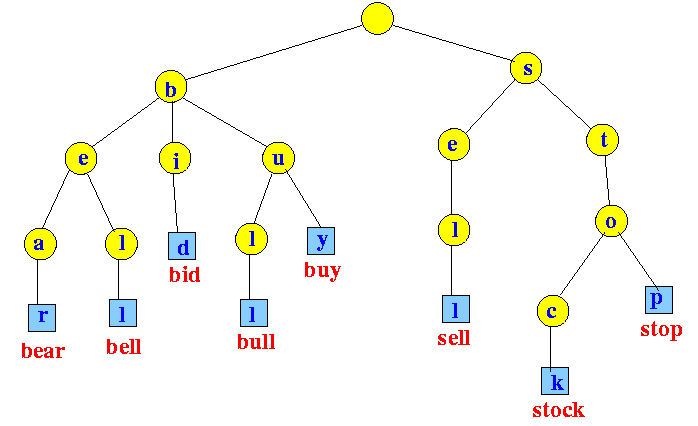

# Implementing a text search using trie data structure. 
1. A trie is a tree like data structure in which all children of a node have a common prefix. 
2. Looking up data in a trie is fast. O(m) is the worst case complexity when length of search string is m. 

Below is a pictorial representation of how we will implement a text search. 
