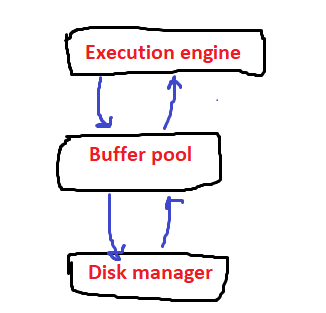

How a database file is structured?
- A file in disk that stored data of a database is just an array of bytes organized in fixed length
blocks called pages. A database file is a linear array of continuous pages.

Buffer pool manager:
- The execution engine does not have access to disk. It has access to an in-memory abstraction
layer which is called buffer pool.
- The execution engine requests pages from the buffer pool by providing a page identifier. 

- It can read the content of the page and send the data to the client. Or it can modify the content of the page and send it back to the buffer pool so that the change can be persisted. 
- The execution engine access the buffer pool thinking that it is accessing the disk.
- The purpose of buffer pool structure is not only to manage a pool of empty buffers and its reuse but also it is responsible for caching the disk pages into memory for future reuse (not only by the requesting thread but also for concurrent threads). 
  A full buffer pool(red page means that page is being 
used by some thread and cannot be removed from the cache)
- What happens when the cache is full, and a page that is not in the cache is requested?  
We have to remove a page from the cache that is not being used.
- 